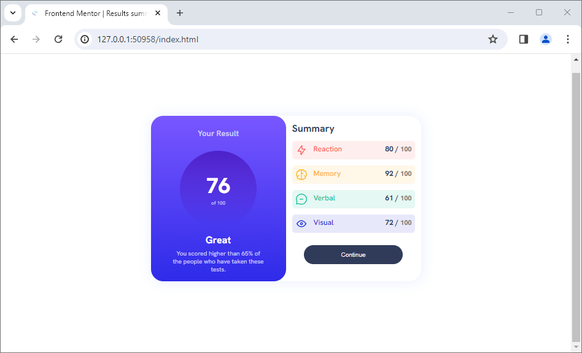
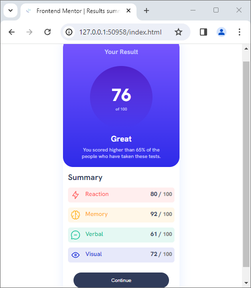

# Frontend Mentor - Results summary component solution

This is a solution to the [Results summary component challenge on Frontend Mentor](https://www.frontendmentor.io/challenges/results-summary-component-CE_K6s0maV). Frontend Mentor challenges help you improve your coding skills by building realistic projects. 

## Table of contents

- [Overview](#overview)
  - [The challenge](#the-challenge)
  - [Screenshot](#screenshot)
  - [Links](#links)
- [My process](#my-process)
  - [Built with](#built-with)
  - [What I learned](#what-i-learned)
  - [Continued development](#continued-development)
- [Author](#author)

## Overview

### The challenge

Users should be able to:

- View the optimal layout for the interface depending on their device's screen size
- See hover and focus states for all interactive elements on the page

### Screenshot

  

### Links

- Solution URL: (https://github.com/mconte10/result_summary_component.git)
- Live Site URL: (https://mconte10.github.io/result_summary_component/)

## My process

### Built with

- Semantic HTML5 markup
- CSS custom properties

### What I learned

With this challenge I learn a lot like how to play with gradient and also how to dynamically change the layout based on which devices is used to run the program.

### Continued development

I want to know focus on creating more interactive programs through the use of JavaScript and its libraries and frameworks.

## Author

- Website - [Maurizio Conte](https://github.com/mconte10)
- Frontend Mentor - [@mconte10](https://www.frontendmentor.io/profile/mconte10)
